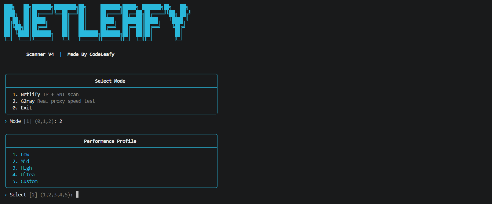
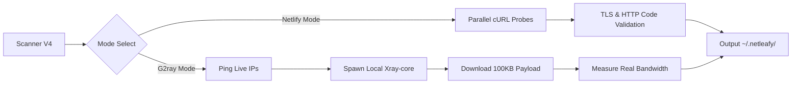

<div align="center">

# NetLeafy Scanner V4

Advanced IP + SNI discovery engine and Real-Proxy Speed Tester for high-speed VLESS & Trojan configurations.

[](https://github.com/Code-Leafy/NetLeafyScanner)
[](https://python.org)
[](https://github.com/Code-Leafy/NetLeafyScanner)
[]()

</div>

---
<div align="center">


<br/>



</div>

<br>

<br>

## Overview

NetLeafy Scanner is a massively parallel IP/SNI discovery and validation tool. With **Version 4**, it now includes the **G2ray Real-Proxy Scanner**, allowing you to parse VLESS/Trojan configurations, spawn temporary local `xray-core` instances, and test actual payload download speeds directly through the proxy.

> **Note:** Designed to work perfectly alongside the **[NetLeafy Web Tool](https://code-leafy.github.io/NetLeafy)**. Scan, copy your results, and generate your optimized config instantly.

---

### Core Features

#### ⚡ G2ray Real-Proxy Scanner (NEW)
Don't just ping IPs—test their actual bandwidth. Parses your `vless://` or `trojan://` links, routes traffic through a local `xray-core` instance, and downloads real payloads to measure exact connection speeds (KB/s or MB/s).

#### 🔍 Massively Parallel Probing Engine
Capable of running up to 200+ concurrent threads. Scans thousands of IP/SNI combinations in seconds using a 2-stage verification process to validate both TLS handshakes and HTTP response codes.

#### 📱 Mobile & Termux Optimized
Includes native support for `termux-wake-lock` to prevent Android from killing the process in the background. Features tailored performance profiles to prevent crashes on low-RAM devices.

#### 🛡️ Multiple Scan Modes
*   **Netlify Full Scan:** Tests combinations of IPs x SNIs.
*   **IP Only:** Blazing fast latency testing for CDN IP lists.
*   **G2ray Test:** Validates actual configuration functionality and bandwidth.

---

## Getting Started

> **⚠️ IMPORTANT DIRECTORY SETUP:**  
> Before running the scanner, you **must** have `ip.txt` and `sni.txt` in the exact same folder as the script. For the G2ray mode to work, you must also place the `xray-core` executable (`xray` or `xray.exe`) in this same directory (or installed globally on your system PATH).

```text
NetLeafyScanner/
├── scanner.py        # The main script
├── ip.txt            # Your list of IPs/Subnets
├── sni.txt           # Your list of SNI domains
└── xray.exe          # (Optional) Required for G2ray Speed Test Mode
```

### Installation

**Prerequisites:** Python 3.7+, `curl` (pre-installed on most OS).

```bash
# Clone the repository
git clone https://github.com/Code-Leafy/NetLeafyScanner.git

# Navigate to the folder
cd NetLeafyScanner

# Ensure you create/edit your ip.txt and sni.txt here!
# Add xray-core to this folder if you plan on using G2ray Mode.

# Launch the scanner
python3 scanner.py
```

<details>
<summary><kbd>🖥️</kbd> OS Specific Instructions</summary>

**Windows:**
1. Install Python from python.org.
2. Download [Xray-core](https://github.com/XTLS/Xray-core/releases) and extract `xray.exe` directly into the `NetLeafyScanner` folder (or `C:\xray\xray.exe`).
3. Run `python scanner.py` in CMD or PowerShell.

**Termux (Android):**
```bash
pkg update && pkg install python curl git
# To use G2ray Mode, you must install xray-core globally
pkg install xray
python scanner.py
```

**Linux:**
```bash
sudo apt update && sudo apt install python3 curl git
# Install xray-core for G2ray mode via official script or extract it to the project folder
python3 scanner.py
```

</details>

---

## Usage

NetLeafy Scanner features a beautiful, dynamic CLI menu. Choose a performance profile based on your hardware:

- <kbd>1</kbd> **Low** — 20 threads / 6s timeout / 2 probes (Best for older mobile devices)
- <kbd>2</kbd> **Mid** — 50 threads / 4s timeout / 3 probes (Standard)
- <kbd>3</kbd> **High** — 100 threads / 3s timeout / 4 probes (Modern desktops)
- <kbd>4</kbd> **Ultra** — 200 threads / 2s timeout / 5 probes (High-end setups/Servers)
- <kbd>5</kbd> **Custom** — User-defined threads, timeout, and ping count.

> 🚀 **Config Optimization:** After the scan, take your results to **[NetLeafy](https://code-leafy.github.io/NetLeafy)**. Select the **G2ray** server option and paste your config there to complete your setup.

---

## Output

Results are auto-saved with timestamps to the `~/.netleafy` directory in your home folder:

```text
~/.netleafy/
├── netlify_20260601_134500.txt       # Full IP + SNI results
├── iponly_20260601_134600.txt        # IP latency scan results
└── g2ray_working_20260601_135000.txt # Working IPs with verified real-proxy speed
```

<details>
<summary><kbd>📁</kbd> Customizing Input Lists</summary>

The scanner reads from two files located in the **same directory as the script**:
*   `ip.txt`: Supports single IPs, CIDR subnets (e.g., `104.16.0.0/24`), and IP ranges (e.g., `104.16.0.1-104.16.0.255`).
*   `sni.txt`: A list of SNI domains to test against.

*If these files are missing, the scanner will auto-generate them with basic default test values.*
</details>

---

## Architecture



---

<details>
<summary><kbd>❓</kbd> FAQ & Troubleshooting</summary>

**Why am I getting "! curl not found"?**
Ensure `curl` is in your system PATH. On Linux/Termux, run `apt install curl` or `pkg install curl`. On Windows, recent versions have it built-in.

**Why am I getting "! xray-core not found"?**
G2ray mode requires `xray-core` to establish the proxy connection.
*   **The easiest fix:** Place the downloaded `xray.exe` (Windows) or `xray` (Linux) directly inside the `NetLeafyScanner` project folder.
*   Alternatively, install it globally (e.g., `pkg install xray` on Termux, or place in `C:\xray\` on Windows).

**Why do all my G2ray speed tests fail?**
Ensure the VLESS/Trojan configuration URI you provided is completely valid and that the base IP/Domain in your URI works. Increase the timeout profile if your network is highly unstable.

</details>

<br>

<div align="center">

> **⚠️ Educational Purpose Only:** This project is intended for network research and educational use. Users are responsible for following local regulations.

[MIT License](https://github.com/Code-Leafy/NetLeafyScanner/blob/main/LICENSE) · Crafted by [Code-Leafy](https://github.com/Code-Leafy)

<br/>

</div>
