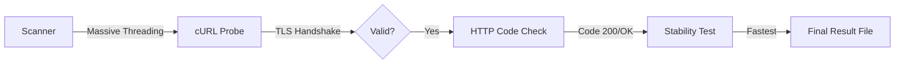

<div align="center">

# NetLeafy Scanner

Advanced IP + SNI discovery engine for high-speed VLESS configurations.

[](https://github.com/Code-Leafy/NetLeafyScanner)
[](https://python.org)
[](https://github.com/Code-Leafy/NetLeafyScanner)
[]()

</div>

---
<div align="center">


<br/>


</div>

<br>

<br>

## Overview

NetLeafy Scanner is a massively parallel IP/SNI discovery tool designed to identify working Cloudflare edge nodes and clean SNI domains. It uses a 2-stage verification process to validate both TLS handshakes and HTTP response codes, ensuring zero fake-positive results.

> **Note:** Designed to work perfectly alongside the **[NetLeafy Web Tool](https://code-leafy.github.io/NetLeafy)**. Scan, copy your results, and generate your optimized config instantly.

---

### Core Features

#### ⚡ Parallel Probing Engine
Capable of running up to 150 concurrent threads. Scans thousands of IP/SNI combinations in seconds without compromising accuracy.

#### 📱 Mobile & Termux Optimized
Includes native support for `termux-wake-lock` and specialized low-RAM performance profiles to prevent crashes on Android devices.

#### 🛡️ 2-Stage Smart Filtering
Drops blocked, reset, or DPI-injected responses automatically. It strictly validates the HTTP code and total connect time to ensure the highest stability.

#### 🔄 Auto-Best Mode
A fully automated sequence: Pings all IPs → Scans working pairs → Performs a 3-probe stability test → Outputs the absolute fastest results.

---

## Getting Started

> **Prerequisites:** Python 3.7+, cURL (pre-installed on most OS).

```bash
# Clone the repository
git clone https://github.com/Code-Leafy/NetLeafyScanner.git

# Navigate to the folder
cd NetLeafyScanner

# Launch the scanner
python3 scanner.py
```

<details>
<summary><kbd>🖥️</kbd> OS Specific Instructions</summary>

**Windows:**
Install Python from python.org, then run `python scanner.py` in PowerShell or CMD.

**Termux (Android):**
```bash
pkg update && pkg install python curl git
python scanner.py
```

</details>

---

## Usage

NetLeafy Scanner features a beautiful CLI menu. Choose a performance profile based on your hardware:

- <kbd>1</kbd> **Low-End Mobile** — 15 threads / 6s timeout
- <kbd>3</kbd> **Desktop** — 60 threads / 3s timeout
- <kbd>4</kbd> **Server/High-End PC** — 120 threads / 2s timeout

> 🚀 **Config Optimization:** After the scan, take your results to **[NetLeafy](https://code-leafy.github.io/NetLeafy)**. Select the **G2ray** server option and paste your config there to complete your setup.

---

## Output

Results are auto-saved with timestamps to your **Downloads** folder (or current directory):

```text
NetLeafyScanner/
├── last_scan.json           # Cached results for stability checking
└── NetLeafy_auto_best.txt    # Sorted results (IP | SNI | Latency)
```

<details>
<summary><kbd>📊</kbd> Scanner Database Stats</summary>

- **IPs in Database:** 130+ Verified CDN Nodes
- **SNIs in Database:** 70+ Clean Domains
- **Total Combinations:** ~9,100 per full scan

</details>

---

## Architecture



---

<details>
<summary><kbd>❓</kbd> FAQ & Troubleshooting</summary>

**Why am I getting "cURL Requirement Failed"?**
Ensure `curl` is in your system PATH. On Linux/Termux, run `apt install curl`. On Windows, recent versions have it built-in.

**What is "Shecan Bypass Mode"?**
It uses specific DNS servers (178.22.122.101) to bypass regional restrictions during the SNI lookup phase.

</details>

<br>

<div align="center">

> **⚠️ Educational Purpose Only:** This project is intended for network research and educational use. Users are responsible for following local regulations.

[MIT License](https://github.com/Code-Leafy/NetLeafyScanner/blob/main/LICENSE) · Crafted by [Code-Leafy](https://github.com/Code-Leafy) · [Telegram Channel](https://t.me/codeleafy)

<br/>

</div>
