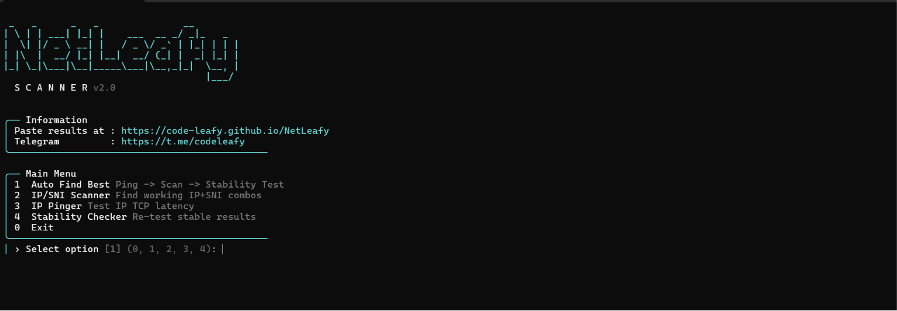

<div align="center">


<br/>




<br/>
<br/>

[](https://python.org)
[](https://github.com/Code-Leafy/NetLeafyScanner)
[](LICENSE)
[](https://t.me/codeleafy)
[](https://github.com/Code-Leafy)

<br/>

> **Find working IP + SNI pairs in seconds. Generate ready-to-use VLESS configs.**  
> Paste your results directly into [NetLeafy](https://Code-Leafy.github.io/NetLeafy) and connect.

<br/>

</div>

---

## ✨ Features

- 🔍 **Dual Scan Modes** — IP/SNI pair discovery or full VLESS config generation
- ⚡ **Massively Parallel** — up to 150 threads, scans thousands of combinations fast
- 📱 **Termux Ready** — auto wake-lock, mobile-safe profiles, tested on Android
- 🛡️ **2-Stage Verification** — validates TLS handshake AND HTTP response, eliminates fake results
- 🌐 **DNS Bypass Support** — Bypass Shecan
- 🎯 **Smart Filtering** — drops blocked, reset, and DPI-injected responses automatically
- 📄 **Auto-saves Results** — timestamped output to your Downloads folder
- 🖥️ **Beautiful CLI** — real-time progress bar, colour-coded hits, clean summary

---

## 📋 Requirements

| Requirement | Notes |
|-------------|-------|
| **Python 3.7+** | `python --version` to check |
| **curl** | Pre-installed on Windows 10+, macOS, most Linux. Termux: `pkg install curl` |
| No pip dependencies | Pure standard library |

---

## 🚀 Installation

### Windows

```bash
# Clone the repo
git clone https://github.com/Code-Leafy/NetLeafyScanner.git
cd NetLeafyScanner

# Run
python scanner.py
```

### Linux / macOS

```bash
git clone https://github.com/Code-Leafy/NetLeafyScanner.git
cd NetLeafyScanner
python3 scanner.py
```

### Termux (Android)

```bash
# Install dependencies
pkg update && pkg install python curl git

# Clone and run
git clone https://github.com/Code-Leafy/NetLeafyScanner.git
cd NetLeafyScanner
python scanner.py
```

> **Tip for Termux:** Keep your screen on or the scan may be killed. The tool calls `termux-wake-lock` automatically — make sure Termux:API is installed (`pkg install termux-api`).

---

## 🎮 Usage

Run the script and follow the interactive prompts:

```
python scanner.py
```

### Step 1 — Choose Scan Mode

```
── Scan Mode
  [1]  IP/SNI Pair Discovery    find working IP + SNI pairs
  [2]  VLESS Config Generator   paste a base VLESS, get optimised configs
```

- **Mode 1** — No VLESS needed. Finds and lists working IP/SNI pairs you can paste into [NetLeafy](https://Code-Leafy.github.io/NetLeafy).
- **Mode 2** — Paste any working VLESS link as a base. The scanner tests it against all IPs and SNIs and returns latency-sorted configs.

### Step 2 — Choose DNS Mode

```
── DNS / Network Mode
  [1]  Direct (No Bypass)
  [2]  Shecan DNS Bypass
```

> If your network blocks the domains directly, use Shecan. Register your IP first at [shecan.ir](https://shecan.ir).

### Step 3 — Choose a Performance Profile

```
── Performance Profile
  [1]  Low-End Mobile / Termux    20 threads
  [2]  Mid-Range Mobile           40 threads
  [3]  Desktop / PC               80 threads
  [4]  High-End PC / Server      150 threads
  [5]  Custom                     set your own
```

| Profile | Device | Threads | Timeout |
|---------|--------|---------|---------|
| 1 | Low-end mobile / Termux | 20 | 5s |
| 2 | Mid-range mobile | 40 | 4s |
| 3 | Desktop / PC | 80 | 3s |
| 4 | High-end PC / Server | 150 | 2s |
| 5 | Custom | you choose | you choose |

> ⚠️ On Termux, stick to profiles 1–2. Higher thread counts can cause crashes on low-RAM devices.

---

## 📂 Output

Results are saved automatically to your **Downloads folder** (or current directory as fallback):

```
~/Downloads/NetLeafy_pairs_20250515_143022.txt
~/Downloads/NetLeafy_vless_20250515_143022.txt
```

Each file contains:

```
==================================================
IPs — copy and paste into NetLeafy
==================================================
104.21.60.220
172.67.150.14
...

==================================================
SNIs — copy and paste into NetLeafy
==================================================
kubernetes.io
helm.sh
...

==================================================
VLESS Configs — sorted fastest first   (Mode 2 only)
==================================================
# 312ms  104.21.60.220  kubernetes.io
vless://...
```

---

## 🌐 Paste Your Results

Once the scan finishes, copy the IPs and SNIs directly into:

### 👉 [Code-Leafy.github.io/NetLeafy](https://Code-Leafy.github.io/NetLeafy)

---

## 📊 Database

| Category | Count |
|----------|-------|
| IPs scanned | 130+ |
| SNIs / Domains | 70+ |
| Total combinations | ~9,100 per scan |

All IPs are public CDN edge nodes. All SNIs are public open-source project domains.

---

## 🛠️ How It Works

```
For each IP × SNI pair:
  └─ curl resolves the domain to the target IP
     └─ TLS handshake attempted
        ├─ Fail (timeout / reset / 000) → dropped
        └─ Success → HTTP response checked
           ├─ Blocked code (403/502/521...) → dropped
           └─ Valid response → recorded ✔
```

**Mode 1** records the working pair.  
**Mode 2** measures total round-trip time and builds a VLESS config with the real latency in the remark.

---

## 📁 Repository Structure

```
NetLeafyScanner/
├── scanner.py        # Main scanner
├── README.md         # This file
└── LICENSE           # MIT License
```

---

## 🤝 Contributing

Pull requests are welcome. For major changes, open an issue first.

1. Fork the repo
2. Create your branch: `git checkout -b feature/my-feature`
3. Commit your changes: `git commit -m 'Add my feature'`
4. Push: `git push origin feature/my-feature`
5. Open a Pull Request

---

## 📣 Channel & Support

<div align="center">

[](https://t.me/codeleafy)

Get the latest configs, updates, and support on Telegram.

</div>

---

## ⚖️ License

This project is licensed under the **MIT License** — see the [LICENSE](LICENSE) file for details.

---

<div align="center">

Made with ❤️ by [Code-Leafy](https://github.com/Code-Leafy)

[](https://github.com/Code-Leafy/NetLeafyScanner/stargazers)
[](https://github.com/Code-Leafy/NetLeafyScanner/network/members)


</div>
